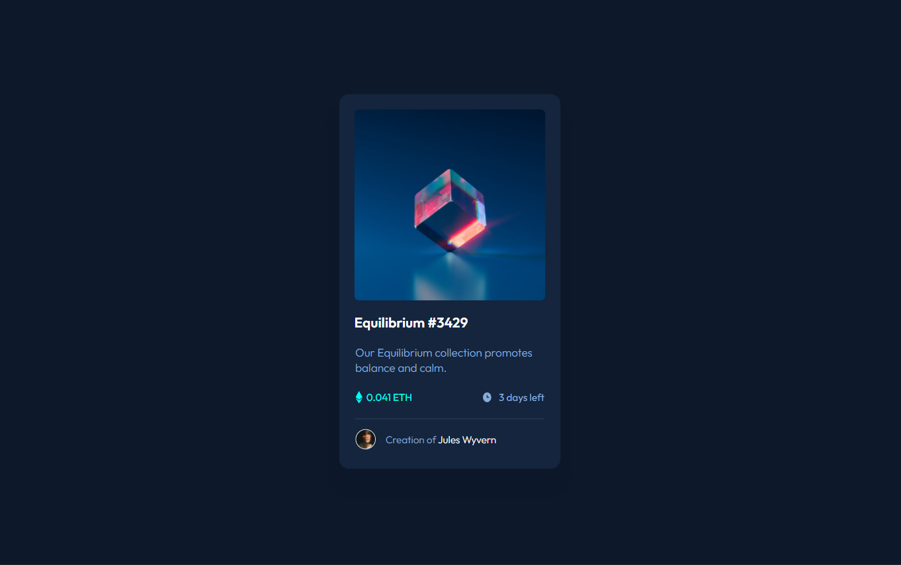

# Frontend Mentor - NFT preview card component solution

This is a solution to the [NFT preview card component challenge on Frontend Mentor](https://www.frontendmentor.io/challenges/nft-preview-card-component-SbdUL_w0U). Frontend Mentor challenges help you improve your coding skills by building realistic projects. 

## Table of contents

- [Overview](#overview)
  - [The challenge](#the-challenge)
  - [Screenshot](#screenshot)
  - [Links](#links)
- [My process](#my-process)
  - [Built with](#built-with)
  - [What I learned](#what-i-learned)
- [Author](#author)

## Overview

### The challenge

Users should be able to:

- View the optimal layout depending on their device's screen size
- See hover states for interactive elements

### Screenshot

### Links

- Solution URL: https://www.frontendmentor.io/solutions/nft-preview-card-component-main-html-css-flexbox-mN9VirVUe
- Live Site URL: https://leon2610.github.io/nft-preview-card-component-main/

## My process

### Built with

- Semantic HTML5 markup
- CSS custom properties
- Flexbox

### What I learned

* Positioning elements with flexbox and CSS
* Working with various CSS properties

## Author

- Website - [Leonel León](https://github.com/Leon2610)
- Frontend Mentor - [@Leon2610](https://www.frontendmentor.io/profile/Leon2610)
- Twitter - [@LeoDev26](https://twitter.com/LeoDev26)

